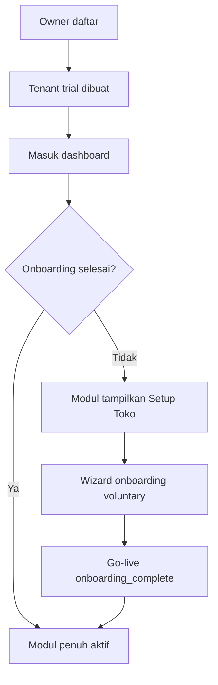
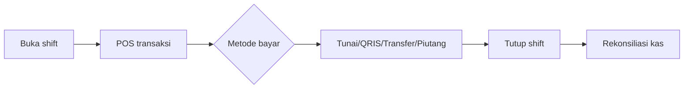

# BRD — SEPS (Simetri ERP Store)

**Business Requirements Document**

| Field | Nilai |
|-------|--------|
| **Produk** | SEPS — Simetri ERP Store (SES) |
| **Versi dokumen** | 1.0 |
| **Tanggal** | 31 Juli 2026 |
| **Status** | Draft — selaras implementasi & PRD |
| **Pemilik produk** | Simetri / Faza Group |
| **URL staging** | https://seps.fazagroup.id |
| **Dokumen terkait** | [PRD_-_SES_Simetri_ERP_Store.md](./PRD_-_SES_Simetri_ERP_Store.md), [PROJECT_CONTEXT.md](./PROJECT_CONTEXT.md) |

---

## 1. Ringkasan Eksekutif

SEPS adalah platform **SaaS ERP** untuk **toko bangunan di Indonesia** yang mengintegrasikan operasional harian—penjualan (POS), persediaan, pembelian, keuangan, piutang/hutang, dan laporan—dalam satu sistem **multi-cabang** dan **multi-tenant**.

Setiap toko yang mendaftar menjadi **tenant** terpisah dengan data yang terisolasi. Pemilik toko dapat mengelola beberapa cabang, menugaskan pegawai per peran dan cabang, serta memantau kinerja bisnis secara real-time atau konsolidasi.

**Proposisi nilai utama:**

- Menggantikan pencatatan manual, buku, dan Excel dengan sistem terpusat.
- Memungkinkan **go-live tanpa menutup toko** melalui onboarding bertahap dan mode stok legacy.
- Memberikan visibilitas laba, arus kas, stok, dan audit operasional untuk keputusan berbasis data.
- Menyediakan **konsol platform** bagi tim internal untuk memantau adopsi, trial, dan kinerja tenant (prospek bisnis).

---

## 2. Latar Belakang Bisnis

### 2.1 Konteks pasar

Toko bangunan skala menengah (semen, bata, cat, pipa, keramik, besi, dll.) sering beroperasi dengan:

- Pencatatan stok tidak akurat antar gudang/cabang.
- Harga jual dan HPP tidak konsisten.
- Piutang pelanggan (tempo/kontraktor) sulit dipantau.
- Kasir dan gudang sulit diaudit.
- Laporan keuangan dibuat manual dan terlambat.
- Keputusan restock dan pricing berdasarkan perkiraan.

### 2.2 Masalah bisnis yang ditanggapi

| # | Masalah | Dampak bisnis |
|---|---------|---------------|
| 1 | Stok tidak akurat | Salah kirim, over/under stock, kehilangan penjualan |
| 2 | Cash flow tidak terlihat | Keputusan beli/jual dan bayar supplier buta |
| 3 | Piutang tidak terkendali | Bad debt, kredit macet |
| 4 | Audit pegawai lemah | Risiko fraud, produktivitas rendah |
| 5 | Barang hilang/rusak tidak terlacak | Kerugian tersembunyi |
| 6 | Laba riil tidak diketahui | Owner tidak yakin bisnis untung atau rugi |
| 7 | Harga jual tidak update | Margin tergerus, komplain pelanggan |
| 8 | Produk terlaris tidak teridentifikasi | Inventory tidak selaras permintaan |
| 9 | Fast-moving sering kosong | Kehilangan omzet |
| 10 | Hutang supplier tidak terkontrol | Cash flow terganggu |
| 11 | Laporan lambat | Keputusan strategis terlambat |
| 12 | Keputusan berdasarkan feeling | Risiko bisnis tinggi |

### 2.3 Peluang

Digitalisasi operasional toko bangunan dengan ERP yang:

- Disesuaikan untuk workflow Indonesia (Bahasa Indonesia, Rupiah, tempo, QRIS manual, dll.).
- Dapat diadopsi bertahap tanpa menghentikan operasional.
- Dijual sebagai langganan SaaS dengan trial untuk menurunkan hambatan masuk.

---

## 3. Tujuan Bisnis

### 3.1 Tujuan strategis

| ID | Tujuan | Indikator keberhasilan |
|----|--------|------------------------|
| **TB-01** | Menjadi sistem operasional utama toko bangunan multi-cabang | Tenant aktif menggunakan POS + inventory minimal 5 hari/minggu |
| **TB-02** | Meningkatkan visibilitas keuangan owner | Owner dapat melihat omzet, laba, piutang, hutang tanpa Excel |
| **TB-03** | Mempercepat onboarding tenant baru | Tenant dapat transaksi pertama ≤ 1 hari setelah registrasi |
| **TB-04** | Mendukung skala SaaS multi-tenant | Banyak toko independen dalam satu platform tanpa kebocoran data |
| **TB-05** | Memberikan intelijen bisnis internal | Tim Simetri memantau trial, adopsi, dan omzet tenant via platform dashboard |

### 3.2 Tujuan operasional (per tenant)

- Akurasi stok meningkat melalui GRN, transfer, dan opname.
- Siklus penjualan harian tercatat lengkap per shift kasir.
- Piutang dan hutang ter-aging dan terbayar terlacak.
- Laporan penjualan dan laba rugi tersedia per cabang dan konsolidasi.

---

## 4. Ruang Lingkup

### 4.1 Dalam lingkup (In Scope)

| Area | Deskripsi |
|------|-----------|
| **Registrasi & autentikasi** | Daftar owner, login username + PIN, sesi aman, opsi Google OAuth |
| **Onboarding toko** | Wizard setup toko voluntary; gate modul sampai setup selesai |
| **Multi-cabang** | CRUD cabang, penugasan pegawai, stok & kas per cabang |
| **Master data** | Produk, kategori, pelanggan, supplier, atribut produk |
| **POS & shift kasir** | Multi-keranjang, metode bayar, piutang, PWA/offline (target) |
| **Inventory** | Stok per cabang, transfer, opname, pergerakan stok |
| **Pembelian** | PO, penerimaan barang, hutang supplier |
| **Penjualan lanjutan** | Sales order, split fulfillment, pengiriman |
| **Keuangan** | Buku kas, piutang, hutang, laporan laba rugi |
| **Laporan & dashboard** | KPI harian/bulanan, audit kasir, konsolidasi owner |
| **Manajemen pegawai** | Role, cabang, PIN |
| **Platform admin** | Dashboard developer: daftar tenant, plan, kinerja 30 hari |
| **Portal pelanggan** | Katalog & order online (fase bertahap) |

### 4.2 Di luar lingkup (Out of Scope) — v1 / fase ini

| Item | Catatan |
|------|---------|
| Payment gateway otomatis (Midtrans, Xendit, dll.) | QRIS/transfer dikonfirmasi manual |
| Integrasi akuntansi eksternal (Accurate, Jurnal, dll.) | Future phase |
| Payroll & HR lengkap | Hanya manajemen pegawai operasional |
| Routing/logistik pihak ketiga | Pengiriman dicatat internal saja |
| Billing self-service upgrade paket | Plan ada di schema; pembayaran langganan TBD |
| Domain portal unik per tenant | Target jangka panjang; saat ini under `/{slug}/shop` |

---

## 5. Pemangku Kepentingan

| Stakeholder | Peran | Kebutuhan bisnis utama |
|-------------|-------|------------------------|
| **Pemilik produk (Simetri/Faza Group)** | Strategi, roadmap, monetisasi | Adopsi SaaS, retensi, revenue per tenant |
| **Platform Admin (internal)** | Operasional platform | Monitor tenant, trial, onboarding, kinerja toko |
| **Owner toko** | Pengguna utama & decision maker | Laba, multi-cabang, kontrol penuh, laporan konsolidasi |
| **Manager cabang** | Operasional harian cabang | Stok, penjualan cabang, approval opname/void |
| **Kasir** | Front-line sales | POS cepat, shift, offline toleran |
| **Staff gudang** | Inventory | GRN, transfer, opname |
| **Akuntan** | Keuangan | Kas, piutang, hutang, laba rugi |
| **Pelanggan (kontraktor/retail)** | Pembeli | Katalog, order, tempo (portal) |
| **Tim teknis** | Build & operate | Skalabilitas, keamanan, uptime |

---

## 6. Persona Pengguna

### 6.1 Budi — Owner toko bangunan

- **Profil:** Pemilik 2–5 cabang, 10–40 pegawai, omzet bulanan ratusan juta–miliar Rupiah.
- **Goals:** Tahu laba riil, kontrol piutang kontraktor, bandingkan kinerja cabang.
- **Pain:** Data tersebar, sulit audit kasir, tidak yakin stok di lapangan.
- **Modul kunci:** Dashboard konsolidasi, Toko Saya, Users, Laporan, Keuangan.

### 6.2 Siti — Manager cabang

- **Profil:** Mengelola 1–2 cabang, fokus operasional harian.
- **Goals:** Stok aman, penjualan lancar, tim produktif.
- **Modul kunci:** Dashboard cabang, Inventory, POS (oversight), Purchasing, Laporan cabang.

### 6.3 Andi — Kasir

- **Profil:** Front desk, transaksi tinggi, internet tidak selalu stabil.
- **Goals:** Checkout cepat, shift jelas, struk keluar.
- **Modul kunci:** POS, Pengiriman, Order online.

### 6.4 Rina — Staff gudang

- **Goals:** Stok fisik = sistem, barang masuk/keluar tercatat.
- **Modul kunci:** Inventory, PO/GRN, Transfer, Opname.

### 6.5 Dedi — Akuntan

- **Goals:** Arus kas, piutang/hutang, laporan laba rugi akurat.
- **Modul kunci:** Keuangan, Piutang, Hutang, Laporan.

### 6.6 Admin SES — Platform operator

- **Goals:** Lihat siapa saja yang trial, siapa yang sudah go-live, omzet per toko untuk prospek bisnis.
- **Modul kunci:** Platform Dashboard (`/platform/dashboard`).

---

## 7. Model Bisnis SaaS

### 7.1 Struktur tenant

- Satu **tenant** = satu bisnis/toko (bisa multi-cabang).
- Isolasi data antar tenant wajib (tidak ada akses silang).
- URL tenant: `https://seps.fazagroup.id/{slug}/...`

### 7.2 Paket langganan

| Plan | Deskripsi bisnis | Status |
|------|------------------|--------|
| **Trial** | Evaluasi 14 hari setelah registrasi | ✅ Aktif (default registrasi) |
| **Basic** | Toko single/multi cabang skala kecil | 📋 Didefinisikan, billing TBD |
| **Pro** | Fitur lanjutan, lebih banyak cabang/user | 📋 TBD |
| **Enterprise** | Custom SLA, volume tinggi | 📋 TBD |

### 7.3 Alur monetisasi (target)

```
Registrasi → Trial 14 hari → Onboarding → Go-live → Upgrade berbayar → Retensi
```

> **Catatan:** Mekanisme pembayaran langganan (invoice, gateway, dunning) belum menjadi bagian rilis saat ini.

---

## 8. Persyaratan Bisnis

Persyaratan dinomori **BR-xxx** untuk pelacakan. Prioritas: **Must** | **Should** | **Could**.

### 8.1 Akuisisi & identitas tenant

| ID | Persyaratan | Prioritas |
|----|-------------|-----------|
| BR-001 | Owner dapat mendaftar akun dengan username unik dan PIN 6 digit | Must |
| BR-002 | Telepon owner wajib; email opsional saat registrasi | Must |
| BR-003 | Alamat owner wajib (provinsi → kelurahan + nama jalan) untuk profil bisnis | Must |
| BR-004 | Sistem membuat tenant trial 14 hari otomatis saat registrasi | Must |
| BR-005 | Owner masuk ke sistem setelah daftar tanpa wajib menyelesaikan wizard onboarding | Must |
| BR-006 | Modul operasional menampilkan ajakan **Setup Toko** jika onboarding belum selesai | Must |
| BR-007 | Modul operasional menampilkan gate setup jika tidak ada cabang/toko aktif | Must |
| BR-008 | Halaman **Toko Saya** tetap dapat diakses meski setup belum selesai | Must |

### 8.2 Onboarding & go-live

| ID | Persyaratan | Prioritas |
|----|-------------|-----------|
| BR-010 | Owner dapat memilih jalur onboarding: toko baru, tanpa catatan, buku, Excel | Must |
| BR-011 | Owner mengisi info toko, cabang, pegawai, dan produk awal via wizard | Must |
| BR-012 | URL/slug toko harus unik; sistem validasi ketersediaan real-time | Must |
| BR-013 | Step produk dapat dilewati tanpa input data | Must |
| BR-014 | Owner dapat kembali dari step selesai untuk mengubah setting sebelumnya | Must |
| BR-015 | **Legacy stock mode** memungkinkan penjualan meski stok belum akurat selama onboarding | Must |
| BR-016 | Setelah onboarding selesai, tenant ditandai `onboarding_complete` dan modul penuh aktif | Must |
| BR-017 | Owner dapat menambah cabang baru setelah onboarding via flow khusus | Must |

### 8.3 Organisasi & akses

| ID | Persyaratan | Prioritas |
|----|-------------|-----------|
| BR-020 | Sistem mendukung role: owner, manager, cashier, warehouse, accountant | Must |
| BR-021 | Akses modul ditentukan oleh role (RBAC) | Must |
| BR-022 | Akses data cabang ditentukan oleh penugasan cabang (`user_branches`) | Must |
| BR-023 | Owner melihat semua cabang + mode konsolidasi | Must |
| BR-024 | Manager hanya cabang yang ditugaskan; dapat switch antar cabang yang diizinkan | Must |
| BR-025 | Kasir/gudang/akuntan terikat satu cabang (tidak switch) | Must |
| BR-026 | Hanya owner yang dapat mengubah HPP (harga beli/pokok) | Must |
| BR-027 | Owner mengelola pegawai, role, dan penugasan cabang | Must |

### 8.4 Multi-cabang & master data

| ID | Persyaratan | Prioritas |
|----|-------------|-----------|
| BR-030 | Master produk terpusat per tenant; harga jual & stok per cabang | Must |
| BR-031 | Owner dapat membuat, menonaktifkan, dan mengaktifkan kembali cabang | Must |
| BR-032 | Pelanggan dan supplier terpusat per tenant | Must |
| BR-033 | Transfer stok antar cabang via dokumen dengan audit trail | Must |
| BR-034 | Kas dan buku kas per cabang | Must |

### 8.5 Penjualan (POS & terkait)

| ID | Persyaratan | Prioritas |
|----|-------------|-----------|
| BR-040 | Kasir wajib buka shift sebelum transaksi | Must |
| BR-041 | POS mendukung multi-keranjang dan metode bayar: tunai, kartu/EDC, QRIS (manual), transfer, piutang | Must |
| BR-042 | Tidak ada payment gateway; konfirmasi pembayaran manual | Must |
| BR-043 | Tutup shift dengan rekonsiliasi kas | Must |
| BR-044 | Void transaksi hanya oleh owner/manager | Must |
| BR-045 | POS dapat beroperasi offline dengan antrian sync (PWA) | Should |
| BR-046 | Transaksi offline direkonsiliasi; flag jika stok defisit atau kredit melebihi limit | Should |
| BR-047 | Sales order mendukung split fulfillment: stok toko + indent supplier | Should |
| BR-048 | Pengiriman barang terhubung ke transaksi/SO | Should |

### 8.6 Persediaan & pembelian

| ID | Persyaratan | Prioritas |
|----|-------------|-----------|
| BR-050 | Penerimaan barang dari PO menambah stok cabang | Must |
| BR-051 | Stock opname dengan approval manager/owner | Must |
| BR-052 | PO dan hutang supplier terlacak per tenant | Must |
| BR-053 | PO indent tidak mengurangi stok toko (langsung ke pelanggan) | Should |

### 8.7 Keuangan

| ID | Persyaratan | Prioritas |
|----|-------------|-----------|
| BR-060 | Piutang pelanggan ter-aging; pembayaran mengurangi outstanding | Must |
| BR-061 | Hutang supplier ter-aging; pembayaran tercatat | Must |
| BR-062 | Buku kas mencatat arus kas per cabang | Must |
| BR-063 | Laporan laba rugi tersedia untuk owner/akuntan | Must |

### 8.8 Laporan & dashboard

| ID | Persyaratan | Prioritas |
|----|-------------|-----------|
| BR-070 | Dashboard menampilkan KPI: omzet hari ini, transaksi, stok rendah, piutang/hutang | Must |
| BR-071 | Owner melihat dashboard konsolidasi + perbandingan antar cabang | Must |
| BR-072 | Laporan penjualan, laba rugi, audit kasir, opname | Must |
| BR-073 | Export laporan PDF/Excel | Should |

### 8.9 Platform admin (internal Simetri)

| ID | Persyaratan | Prioritas |
|----|-------------|-----------|
| BR-080 | Akun platform admin terpisah dari owner tenant | Must |
| BR-081 | Platform admin login via halaman login yang sama, diarahkan ke dashboard khusus | Must |
| BR-082 | Dashboard menampilkan daftar tenant: owner, kontak, plan, status onboarding | Must |
| BR-083 | Dashboard menampilkan jumlah cabang aktif, user, transaksi & omzet 30 hari per tenant | Must |
| BR-084 | Ringkasan agregat: total tenant, trial, omzet platform 30 hari | Must |
| BR-085 | Data tenant antar owner tidak dapat diakses oleh tenant user biasa | Must |

### 8.10 Portal pelanggan

| ID | Persyaratan | Prioritas |
|----|-------------|-----------|
| BR-090 | Pelanggan dapat melihat katalog produk tenant | Could |
| BR-091 | Pelanggan dapat order online; order masuk ke sistem internal | Could |
| BR-092 | Stok exact tidak ditampilkan ke pelanggan | Must (jika portal aktif) |
| BR-093 | Portal per tenant (domain/subpath terpisah) | Could (future) |

### 8.11 Non-fungsional (bisnis)

| ID | Persyaratan | Prioritas |
|----|-------------|-----------|
| BR-100 | UI Bahasa Indonesia; mata uang Rupiah; format tanggal Indonesia | Must |
| BR-101 | Responsif: desktop, tablet, mobile (terutama POS) | Must |
| BR-102 | Dark mode & light mode | Should |
| BR-103 | Data tenant terisolasi — zero cross-tenant leakage | Must |
| BR-104 | Uptime target production ≥ 99% (staging/production hosted) | Should |

---

## 9. Aturan Bisnis

### 9.1 Tenant & cabang

1. Setiap tenant memiliki minimal satu cabang (HQ) saat registrasi.
2. Slug tenant unik secara global.
3. Nama toko boleh sama antar tenant; slug tidak boleh sama.
4. Cabang nonaktif tidak dihitung sebagai cabang operasional; modul di-gate sampai ada cabang aktif.
5. Owner satu-satunya role yang dapat menutup/membuka cabang dan melihat konsolidasi.

### 9.2 Produk & stok

1. HPP (harga beli) hanya dapat diubah oleh owner.
2. Harga jual dapat berbeda per cabang.
3. Stok dihitung independen per cabang.
4. Legacy mode: selama onboarding, penjualan diizinkan meski stok tercatat nol (dengan penanda legacy).
5. Transfer stok: pengirim berkurang saat status *sent*; penerima bertambah saat *received*.

### 9.3 POS & kasir

1. Tidak ada transaksi tanpa shift aktif.
2. Piutang hanya untuk pelanggan tipe kredit dengan limit yang terdefinisi.
3. QRIS/transfer: kasir/manager konfirmasi manual (tidak auto-capture bank).
4. Void memerlukan otorisasi manager atau owner.

### 9.4 Keuangan

1. Piutang terpusat per tenant (pelanggan boleh transaksi di cabang manapun).
2. Hutang supplier terpusat per tenant.
3. Pembayaran piutang/hutang tercatat dan tercermin di buku kas cabang terkait.

### 9.5 Langganan

1. Registrasi baru default plan = **trial**, durasi 14 hari.
2. Trial end date disimpan di profil tenant.
3. Upgrade plan dan suspend tenant (future): hanya platform admin / billing system.

---

## 10. Alur Bisnis Utama

### 10.1 Registrasi → operasional



### 10.2 Hari operasional kasir



### 10.3 Procurement → stok

```
Buat PO → Approval → Kirim ke supplier → GRN → Stok bertambah → Hutang tercatat → Bayar supplier
```

### 10.4 Monitoring platform (internal)

```
Platform admin login → Dashboard → Lihat tenant/trial/omzet → Follow-up prospek bisnis
```

---

## 11. Kriteria Keberhasilan Bisnis

### 11.1 Adopsi tenant

| Metrik | Target (tahun 1 — contoh) |
|--------|---------------------------|
| Tenant terdaftar | [TBD — isi target bisnis] |
| Trial → go-live (onboarding complete) | ≥ 60% |
| Tenant aktif bulanan (MAU) | ≥ 70% dari go-live |
| Retensi 90 hari | ≥ 50% |

### 11.2 Operasional tenant

| Metrik | Arti keberhasilan |
|--------|-------------------|
| Time-to-first-transaction | ≤ 24 jam setelah registrasi |
| Transaksi POS/hari/cabang | Data tercatat ≥ 95% penjualan fisik |
| Rekonsiliasi shift | Selisih kas tercatat & ≤ threshold owner |
| Akurasi stok pasca opname | Variance ≤ target owner |

### 11.3 Platform

| Metrik | Target |
|--------|--------|
| Zero cross-tenant data incident | 0 |
| Platform dashboard availability | Sesuai uptime production |
| Trial conversion to paid | [TBD setelah pricing final] |

---

## 12. Asumsi

1. Target utama: **toko bangunan Indonesia** dengan operasi 1–10 cabang.
2. Pengguna internal cukup literat smartphone/PC dasar.
3. Internet di toko tidak selalu stabil — POS offline diperlukan untuk adopsi kasir.
4. Pembayaran digital dikonfirmasi manual (owner tidak ingin fee gateway per transaksi di fase awal).
5. Tim Simetri/Faza Group mengoperasikan platform admin dan support onboarding awal.
6. Database shared multi-tenant memadai untuk skala awal–menengah.
7. Regulasi PDP (data pribadi) diindahkan; data owner disimpan untuk keperluan bisnis tenant.

---

## 13. Keterbatasan & Risiko

| Risiko | Dampak | Mitigasi |
|--------|--------|----------|
| Adopsi lambat karena resistensi pegawai | Trial tidak convert | Onboarding mudah, legacy mode, training |
| Internet mati di cabang | Kehilangan penjualan | PWA offline + sync queue |
| Data entry salah saat migrasi | Stok & laporan salah | Wizard import + opname awal |
| Kebocoran data antar tenant | Legal & reputasi | Tenant isolation di API + DB |
| Billing belum otomatis | Revenue leakage pasca trial | Reminder manual; prioritas integrasi billing |
| Ketergantungan Neon/Railway | Downtime | Monitoring, backup, scaling plan |

---

## 14. Dependensi

| Dependensi | Jenis |
|------------|-------|
| Neon PostgreSQL | Infrastruktur data |
| Railway / hosting | Deploy production |
| DNS Hostinger (`seps.fazagroup.id`) | Akses publik |
| API wilayah Indonesia (provinsi/kota) | Registrasi alamat |
| Google OAuth (opsional) | Login alternatif |
| Perangkat kasir (tablet/PC) + printer Bluetooth | Operasional POS |

---

## 15. Glosarium

| Istilah | Definisi |
|---------|----------|
| **Tenant** | Satu bisnis/toko yang berlangganan SEPS |
| **Cabang / Branch** | Outlet fisik under satu tenant |
| **Owner** | Pemilik bisnis; akses penuh tenant |
| **Slug** | Identifikator URL unik tenant (contoh: `toko-simetri`) |
| **Onboarding** | Wizard setup awal toko sebelum operasional penuh |
| **Legacy mode** | Mode stok longgar saat migrasi dari sistem manual |
| **HPP** | Harga pokok penjualan / harga beli produk |
| **POS** | Point of Sale — modul kasir |
| **SO** | Sales Order — pesanan penjualan formal/indented |
| **GRN** | Goods Receipt Note — penerimaan barang dari supplier |
| **Opname** | Stock opname — penghitungan fisik stok |
| **Platform Admin** | Operator internal Simetri; bukan user tenant |
| **Trial** | Masa evaluasi 14 hari sebelum langganan berbayar |

---

## 16. Pertanyaan Terbuka (perlu klarifikasi pemilik produk)

Bagian ini dapat dilengkapi sebelum BRD v1.1 final:

| # | Pertanyaan |
|---|------------|
| 1 | **Pricing:** Berapa harga Basic / Pro / Enterprise (bulanan/tahunan)? Limit cabang/user per plan? |
| 2 | **Trial:** Apa yang terjadi setelah 14 hari jika belum upgrade? Read-only, suspend, atau grace period? |
| 3 | **Support model:** Apakah onboarding dibantu manual oleh tim Simetri (paid onboarding) atau self-service sepenuhnya? |
| 4 | **Target numerik:** Berapa target tenant aktif tahun 1? |
| 5 | **Portal pelanggan:** Prioritas go-live portal vs modul internal? Domain terpisah per tenant kapan? |
| 6 | **Branding:** Produk di pasar sebagai **SEPS**, **SES**, atau **Simetri ERP**? |
| 7 | **Integrasi:** Apakah integrasi WhatsApp notifikasi / payment gateway masuk roadmap 6–12 bulan? |
| 8 | **Compliance:** Apakah ada kebutuhan audit log khusus (SOX-like) atau export untuk pajak? |

---

## 17. Referensi & relasi dokumen

| Dokumen | Fungsi |
|---------|--------|
| **BRD (dokumen ini)** | *What & why* — kebutuhan bisnis, stakeholder, aturan |
| [PRD_-_SES_Simetri_ERP_Store.md](./PRD_-_SES_Simetri_ERP_Store.md) | *How (product)* — spesifikasi fitur, UI, acceptance criteria teknis |
| [PROJECT_CONTEXT.md](./PROJECT_CONTEXT.md) | Konteks teknis untuk tim development |
| [FINANCE_MODULE.md](./FINANCE_MODULE.md) | Detail bisnis modul keuangan |
| [DEPLOY.md](./DEPLOY.md) | Deploy & operasional production |

---

*Dokumen ini disusun berdasarkan PRD, implementasi codebase per Juli 2026, dan sesi pengembangan terbaru (registrasi, onboarding voluntary, platform dashboard, gate cabang aktif). Revisi berikutnya setelah pertanyaan terbuka §16 dijawab.*
