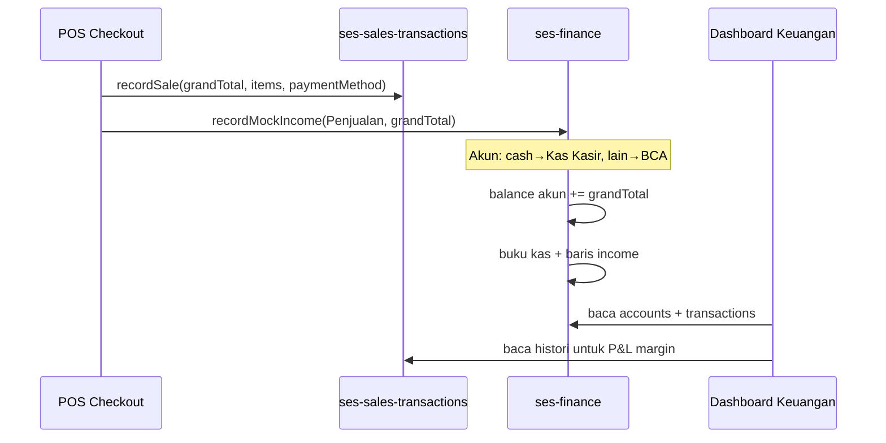
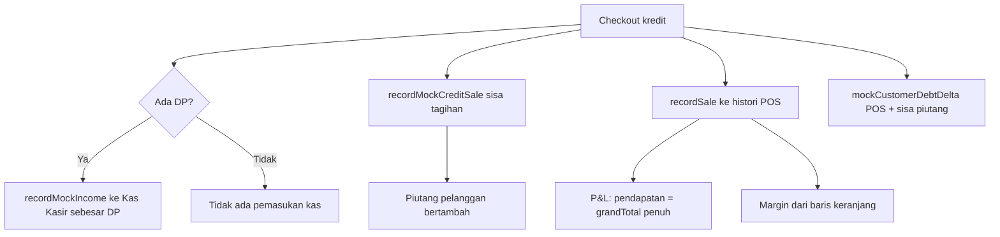
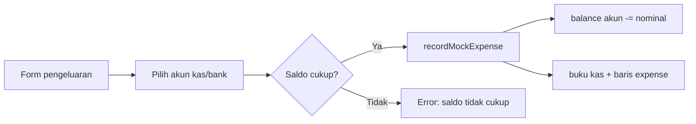
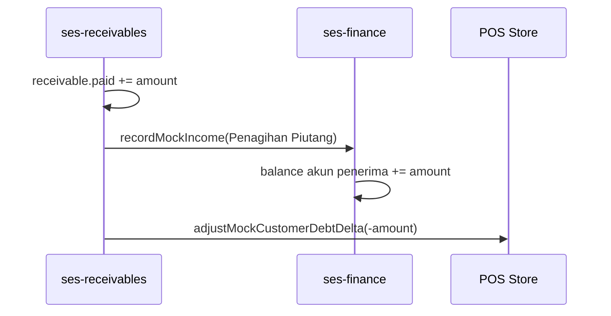
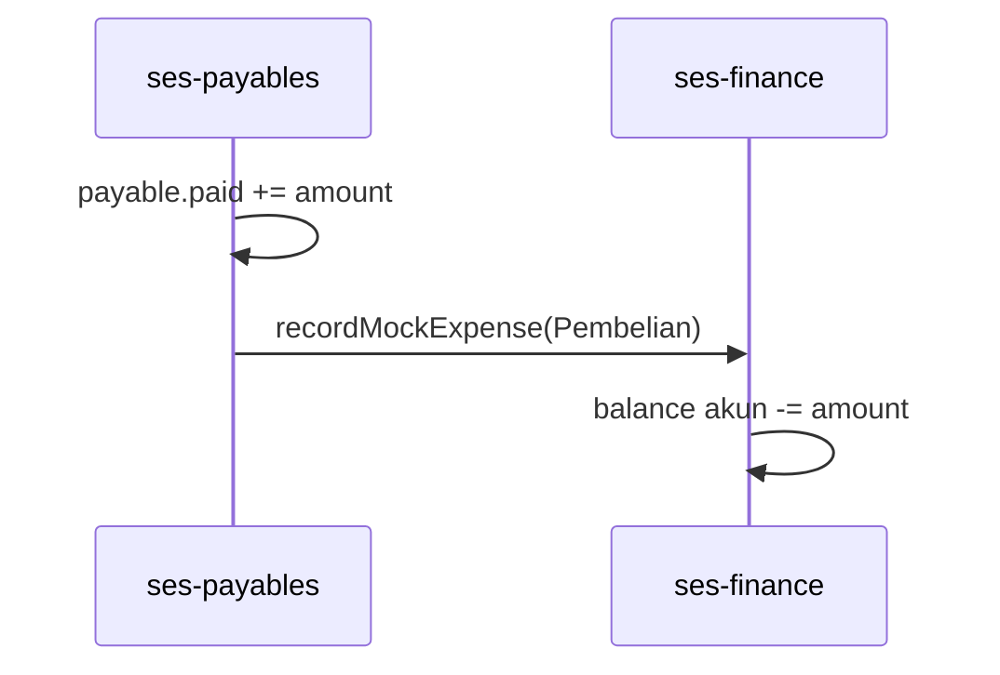

# Modul Keuangan — Progress, Logika Bisnis & Alur Perubahan

> **Proyek:** Simetri ERP Store (demo) · **Tenant mock:** `toko-simetri`  
> **Terakhir diperbarui:** 2026-07-07  
> **Status:** Iterasi demo — data mock + persist `localStorage`, integrasi POS aktif

---

## 1. Ringkasan progress

| Area | Status | Keterangan |
|------|--------|------------|
| Dashboard Keuangan (`/finance`) | ✅ | Saldo, P&L, arus kas, ringkasan piutang |
| Buku Kas (`/finance/cash-book`) | ✅ | Daftar transaksi + catat pengeluaran manual |
| Piutang (`/receivables`) | ✅ | Aging, catat bayar, sinkron kas |
| Hutang Supplier (`/payables`) | ✅ | Aging, catat bayar, kurangi kas |
| Laporan Laba Rugi (`/reports/profit-loss`) | ✅ | Sumber sama dengan dashboard P&L |
| Integrasi checkout POS → kas | ✅ | Tunai/transfer/QRIS/kartu + DP kredit |
| Integrasi POS → piutang | ✅ | Sisa kredit masuk AR |
| P&L margin keuntungan (bukan HPP) | ✅ | Dari histori penjualan POS |
| Persist sesi (`localStorage`) | ✅ | `ses-finance`, `ses-receivables`, `ses-payables` |
| Sinkron ulang penjualan → buku kas | ✅ | `initializeMockFinance` |
| Tenant Supabase nyata | 🔄 | API ada; catat pengeluaran belum |

**Role yang boleh akses:** `owner`, `manager`, `accountant` (lihat `src/lib/rbac.ts`).

---

## 2. Peta modul & file utama

```
Keuangan (sidebar)
├── /finance              → Ringkasan Keuangan
├── /finance/cash-book    → Buku Kas
├── /receivables          → Piutang Pelanggan
├── /payables             → Hutang Supplier
└── /reports/profit-loss  → Laporan Laba Rugi (terkait)

Stores (sumber kebenaran demo)
├── ses-finance           → akun kas/bank + transaksi buku kas
├── ses-receivables       → piutang + pembayaran AR
├── ses-payables          → hutang + pembayaran AP
└── ses-sales-transactions → histori penjualan POS (untuk P&L & sinkron kas)

Logika inti
├── src/lib/finance-calculations.ts   → P&L, arus kas
├── src/lib/receivables-calculations.ts → ringkasan piutang
├── src/lib/mock-finance.ts           → seed akun, mapping POS → akun
└── src/lib/finance-scope.ts          → filter per cabang / konsolidasi
```

---

## 3. Konsep cabang & scope data

### 3.1 Cabang demo

| Cabang | ID (suffix) | Seed saldo awal | Seed riwayat buku kas |
|--------|-------------|-----------------|------------------------|
| Sudirman | `...0001` | Rp 0 (kosong) | Tidak ada |
| Kebon Jeruk | `...0002` | Saldo seed penuh | Ada (`CASH_BOOK`) |
| Bekasi | `...0003` | Rp 0 (kosong) | Tidak ada |

### 3.2 Akun per cabang (4 slot)

Setiap cabang memiliki:

| Slot | Nama | Tipe |
|------|------|------|
| `kasir` | Kas Kasir | `cash` |
| `brankas` | Kas Brankas | `cash` |
| `bca` | BCA - … | `bank` |
| `mandiri` | Mandiri - … | `bank` |

Fungsi: `getBranchCashAccountId(branchId, role)` di `src/lib/mock-finance.ts`.

### 3.3 Mode tampilan

| Mode | Siapa | `branchIds` yang dipakai |
|------|-------|--------------------------|
| Cabang aktif | Semua role | `[activeBranch.id]` |
| Konsolidasi | Owner saja | Semua cabang tenant |

**Catat pengeluaran** hanya di **cabang spesifik** (bukan konsolidasi).

---

## 4. Logika bisnis — rumus & sumber data

### 4.1 Total saldo cabang

```
Total Saldo Cabang = Σ saldo semua akun kas/bank cabang tersebut
                   = Kas Kasir + Kas Brankas + BCA + Mandiri
```

Implementasi (`useFinance.ts`):

```ts
totalBalance = accounts.reduce((s, a) => s + a.balance, 0)
```

`accounts` = akun yang sudah difilter `branchIds` aktif.

### 4.2 Kas vs Bank

```
Kas   = Σ balance akun dengan type === "cash"
Bank  = Σ balance akun dengan type === "bank"

Total Saldo = Kas + Bank   (selalu, jika hanya ada kedua tipe ini)
```

### 4.3 Saldo akun (mutasi)

Saldo akun **bukan** dihitung ulang dari nol setiap render; disimpan di `mockCashAccounts[].balance` dan diubah setiap transaksi:

| Aksi | Dampak saldo |
|------|----------------|
| Pemasukan (`recordMockIncome`) | `balance += amount` |
| Pengeluaran (`recordMockExpense`) | `balance -= amount` (validasi: saldo cukup) |
| Entri HPP lama | **Tidak** mengubah saldo (kategori legacy) |

### 4.4 Pendapatan penjualan (P&L — bulan berjalan)

**Sumber utama:** histori POS `ses-sales-transactions`, bukan buku kas.

```
Pendapatan Penjualan = Σ grandTotal
  untuk setiap transaksi POS status "completed"
  dalam periode bulan ini (tanggal lokal)
  pada cabang yang sedang dilihat
```

Baris Sales Order (`isSoLine === true`) tetap masuk `grandTotal` penjualan, tetapi **tidak** masuk perhitungan margin baris (stok tidak dikurangi di POS).

### 4.5 Total margin keuntungan (menggantikan tampilan HPP)

Per baris keranjang (non-SO):

```
Margin baris = subtotal − (purchasePrice × qty)
```

Agregat:

```
Total Margin Keuntungan = Σ margin baris (semua penjualan periode)
Laba Bersih             = Total Margin Keuntungan − Biaya Operasional
```

Persentase:

```
Margin keuntungan (%) = round((Total Margin / Pendapatan) × 100)
Margin laba bersih (%) = round((Laba Bersih / Pendapatan) × 100)
```

**Catatan:** `cogs` masih ada internal (`Pendapatan − Margin`) tetapi **tidak ditampilkan** sebagai HPP di UI.

### 4.6 Biaya operasional (opex)

Dari **buku kas** (`mockCashTransactions`), kategori expense **kecuali** `HPP` dan `Pembelian`:

```
Opex = Σ amount
  WHERE type = "expense"
  AND category NOT IN ("HPP", "Pembelian")
  AND tanggal dalam periode
```

Kategori pengeluaran manual: Operasional, Utilitas, Pembelian, Gaji, Transport, Lainnya.

### 4.7 Arus kas (14 hari)

Per hari:

```
Masuk  = Σ income
Keluar = Σ expense (exclude kategori HPP)
```

Transfer: amount positif → masuk, negatif → keluar.

### 4.8 Ringkasan piutang (dashboard Keuangan)

| Metrik | Logika |
|--------|--------|
| Saldo piutang aktif | Σ `(amount − paid)` untuk invoice belum lunas |
| Piutang baru (bulan ini) | Σ `amount` invoice terbit (`issuedDate`) di bulan berjalan |
| Ditagih (bulan ini) | Σ pembayaran AR (`paymentDate`) di bulan berjalan |
| Piutang terlambat | Sisa tagihan dengan `dueDate` sudah lewat |

### 4.9 Piutang & hutang (halaman AR/AP)

```
Sisa tagihan = amount − paid
Status       = lunas / partial / overdue (dari `getArApStatus`)
```

---

## 5. Alur perubahan data (event → dampak)

### 5.1 Checkout POS — pembayaran tunai / transfer / QRIS / kartu



**Mapping metode bayar → akun** (`resolveCashAccountForPayment`):

| Metode POS | Akun tujuan |
|------------|-------------|
| `cash` | Kas Kasir |
| `card`, `transfer`, `qris_edc`, dll. | BCA |
| `credit` | Tidak masuk kas penuh (lihat 5.2) |

**Dampak UI:**

- **Kas / Bank / Total saldo** → naik (pemasukan ke akun terkait)
- **Pendapatan penjualan** → naik (`grandTotal`)
- **Margin keuntungan** → naik (`Σ subtotal − beli×qty`)
- **Buku kas** → baris masuk kategori `Penjualan`

### 5.2 Checkout POS — penjualan kredit



| Komponen | Perubahan |
|----------|-----------|
| Kas | Hanya **DP** (jika ada) |
| Piutang | **Sisa** = `grandTotal − amountPaid` |
| P&L penjualan | **Nilai penuh** `grandTotal` (dari histori POS) |
| Limit kredit POS | `outstanding_debt` naik via delta |

### 5.3 Catat pengeluaran manual (Buku Kas)

**Prasyarat:** cabang spesifik dipilih, bukan mode konsolidasi.



**Dampak:**

- Saldo akun & **Total saldo** turun
- **Biaya operasional** naik (jika kategori bukan Pembelian/HPP)
- **Laba bersih** turun
- Arus kas: keluar di hari transaksi

### 5.4 Catat pembayaran piutang (Pelanggan)



**Dampak:**

- Piutang: sisa tagihan turun
- Kas/Bank: naik
- P&L penjualan: **tidak** naik (bukan penjualan baru)
- Limit kredit pelanggan di POS: turun

### 5.5 Catat pembayaran hutang supplier



**Dampak:**

- Hutang: sisa turun
- Kas/Bank: turun
- Opex: **tidak** naik (kategori `Pembelian` dikecualikan dari opex)

### 5.6 Sinkron awal / perbaikan data (`initializeMockFinance`)

Dipanggil saat buka **Keuangan** atau **Buku Kas** (tenant mock):

1. **`ensureMockCashAccounts`** — pastikan 4 akun ada per cabang (termasuk cabang dari histori POS).
2. **Backfill buku kas** — untuk setiap penjualan POS `completed` yang belum punya baris income (cek `reference === transactionNumber`):
   - Non-kredit → income penuh `grandTotal`
   - Kredit dengan DP → income sebesar `amountPaid`

Ini memperbaiki kas Rp 0 meskipun histori penjualan sudah ada.

### 5.7 Perubahan yang TIDAK menyentuh keuangan (saat ini)

| Event | Status |
|-------|--------|
| Purchase Order / Goods Receipt | Tidak auto-update hutang/kas |
| Stock opname | Tidak auto-update kas |
| Sales Order fulfillment | Tidak entri kas (sudah di POS checkout) |
| Tenant Supabase nyata — catat pengeluaran | Belum diimplementasi |

---

## 6. Tampilan UI & format angka

- Semua nominal memakai helper `rupiah()` → format `Rp 124.100` (sama dengan panel Total Tagihan POS).
- Komponen: `CurrencyDisplay` — **tanpa** `font-mono`; wrapper parent pakai `font-bold` / `text-2xl` untuk angka besar.
- Periode P&L default: **bulan kalender berjalan** (tanggal lokal, bukan UTC).

---

## 7. Persistensi & reset

| Key localStorage | Isi |
|------------------|-----|
| `ses-finance` | `mockCashAccounts`, `mockCashTransactions` |
| `ses-receivables` | `mockReceivables`, `mockPayments` |
| `ses-payables` | `mockPayables`, `mockPayments` |
| `ses-sales-transactions` | histori penjualan POS |

**Re-hydrate:** saat load, akun cabang diperbaiki otomatis jika hilang/korup.

**Reset manual developer:** hapus key di DevTools → Application → Local Storage, lalu refresh.

---

## 8. Changelog iterasi keuangan (2026-07-03 s/d 2026-07-04)

| Tanggal | Perubahan | Dampak alur |
|---------|-----------|-------------|
| 07-03 | Persist finance / receivables / payables | Data survive refresh |
| 07-03 | P&L dari histori POS | Penjualan & margin ikut checkout |
| 07-04 | Font angka = format checkout | UI konsisten |
| 07-04 | HPP → Total Margin Keuntungan | P&L tampil margin, bukan HPP |
| 07-04 | Form pengeluaran: native select + fix reset form | Bisa pilih akun & input nominal |
| 07-04 | `ensureMockCashAccounts` + `initializeMockFinance` | Akun cabang selalu ada; kas sinkron dari POS |
| 07-07 | Audit logika + perbaikan data statis | P&L tidak fallback ledger; sync AR/AP ke kas; dashboard dinamis |

---

## 8b. Hasil audit logika (2026-07-07)

| Temuan | Dampak | Perbaikan |
|--------|--------|-----------|
| P&L fallback ke buku kas jika `salesRecords` kosong | Penjualan seed `CASH_BOOK` masuk P&L padahal seharusnya hanya dari POS | `salesRecords !== undefined` → selalu pakai POS (boleh 0) |
| Periode P&L laporan vs dashboard beda | Dashboard = bulan penuh; laporan = s/d hari ini | `getMonthDateRange` diseragamkan (finance-calculations) |
| Pembayaran piutang/hutang seed tidak di buku kas | `paid` naik tapi saldo kas tidak berubah | `syncHistoricalArApPayments` + referensi unik `ar:` / `ap:` |
| Default akun piutang `"cash"` invalid | Fallback gagal jika akun tidak dipilih | Diganti `"kasir"` |
| Dashboard pakai `FINANCE_SUMMARY` statis | Angka tidak ikut transaksi | `useDashboard` baca store + `computeProfitLoss` |
| Hutang supplier tidak bisa ditambah dari PO | Hanya seed `PAYABLES` | **Belum** — by design demo |

**Catatan logika yang sudah benar (tidak diubah):**

- Penjualan kredit: P&L = `grandTotal` penuh (accrual); kas hanya DP
- Pembayaran piutang: kas naik, P&L penjualan tidak naik lagi
- Pembayaran hutang: kategori `Pembelian` tidak masuk opex
- Margin baris SO (`isSoLine`) dikecualikan dari margin keuntungan

---

## 9. Checklist uji manual

- [x] P&L cabang tanpa penjualan POS = Rp 0 (bukan angka seed buku kas)
- [x] Pembayaran piutang/hutang seed tersinkron ke saldo kas setelah buka modul keuangan
- [x] Dashboard ringkasan keuangan mengikuti store (bukan `FINANCE_SUMMARY` statis)
- [ ] Checkout tunai di cabang X → **Kas** di Keuangan cabang X naik
- [ ] Checkout kredit penuh → **Piutang** naik, **Kas** tidak (kecuali ada DP)
- [ ] Catat pengeluaran → saldo turun, opex naik, laba bersih turun
- [ ] Bayar piutang → kas naik, piutang turun
- [ ] Bayar hutang → kas turun
- [ ] Mode konsolidasi (owner) → total = jumlah semua cabang
- [ ] Refresh browser → angka tetap (persist)
- [ ] Ganti cabang → angka mengikuti scope cabang

---

## 10. Rencana lanjutan (belum dikerjakan)

1. Import Excel Master Barang → entri keuangan (masih terpisah).
2. PO/GR → auto hutang supplier.
3. Tenant Supabase: `recordExpense` via API.
4. Rekonsiliasi shift kasir ↔ buku kas Kas Kasir.
5. Export buku kas / laporan keuangan PDF-Excel.

---

## 11. Referensi kode cepat

| Kebutuhan | File |
|-----------|------|
| Hook dashboard | `src/hooks/useFinance.ts` |
| Hook buku kas | `src/hooks/useCashBook.ts` |
| Store mutasi kas | `src/stores/finance.store.ts` |
| Rumus P&L & arus kas | `src/lib/finance-calculations.ts` |
| Mapping POS → akun | `src/lib/mock-finance.ts` |
| Checkout → keuangan | `src/stores/pos.store.ts` → `recordMockFinanceFromSale` |
| Form pengeluaran | `src/components/finance/ExpenseFormDialog.tsx` |
| Kartu P&L | `src/components/finance/ProfitLossCard.tsx` |

---

*Dokumen ini khusus modul Keuangan. Untuk log pekerjaan umum proyek, lihat `PROGRESS_LOG.md`.*
