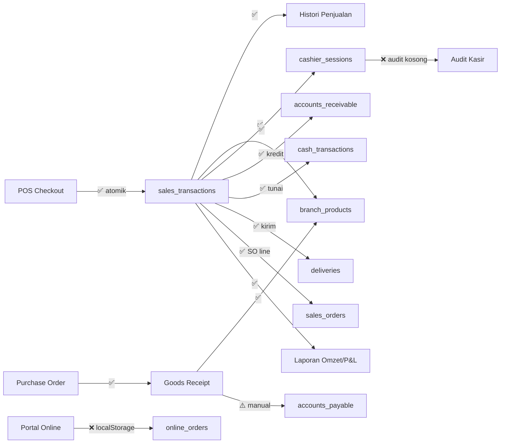

# Checklist Sinkronisasi Data SEPS

**Tanggal uji:** 31 Juli 2026  
**Backend:** Neon PostgreSQL (`VITE_DATA_BACKEND=neon`)  
**Skrip otomatis:** `npm run neon:uat:sync`  
**Hasil terakhir:** 20/20 passed, 4 warning (gap arsitektur + 8 penjualan historis pre-fix)

---

## Ringkasan Eksekutif

| Kategori | Status |
|----------|--------|
| **POS → Histori → Stok → Sesi kasir** | ✅ Sinkron (transaksi DB atomik) |
| **POS kredit → Piutang (AR)** | ✅ Sinkron saat checkout |
| **Laporan omzet / P&L / top produk** | ✅ Baca dari `sales_transactions` / `sales_items` |
| **PO → GRN → Stok** | ✅ Sinkron (transaksi atomik) |
| **Pembayaran AR/AP → Buku kas** | ✅ Sinkron saat input manual pembayaran |
| **POS tunai/transfer → Buku kas** | ✅ Auto-post (penjualan baru) |
| **POS → Pengiriman** | ✅ Insert `deliveries` saat checkout kirim |
| **POS baris SO → Sales Order** | ✅ Insert `sales_orders` saat checkout |
| **Order online → POS/Stok** | ❌ **Belum sinkron** (localStorage saja) |
| **GRN → Hutang (AP)** | ⚠️ Manual (tidak auto dari penerimaan barang) |
| **Void penjualan → AR** | ⚠️ Sebagian (utang pelanggan saja, baris AR tidak di-update) |
| **Audit kasir (laporan)** | ❌ Kosong di tenant Neon |

---

## Checklist Alur Data

Legenda: ✅ Lulus | ⚠️ Peringatan / partial | ❌ Gagal / belum implementasi | 🔲 Uji manual

### A. POS & Penjualan

| # | Alur | Harapan | Status | Bukti / Catatan |
|---|------|---------|--------|-----------------|
| A1 | Checkout POS → `sales_transactions` | 1 header per transaksi | ✅ | `createSaleTransaction` — TX atomik |
| A2 | Checkout POS → `sales_items` | Item = qty × harga | ✅ | FK integrity: 0 orphan |
| A3 | POS → **Histori Penjualan** | Transaksi muncul di list | ✅ | `listSalesHistoryForBranches` same table |
| A4 | POS → **Stok cabang** | Stok berkurang sesuai qty | ✅ | Baris SO (`is_so_line`) **tidak** mengurangi stok |
| A5 | POS → **stock_movements** | Movement `out` + referensi TRX | ✅ | Hanya baris stok toko (bukan SO) |
| A6 | POS → **cashier_sessions** | total_sales, total_transactions update | ✅ | Rekonsiliasi session ↔ TX: 0 mismatch |
| A7 | POS offline → sync | Idempotent via `client_tx_id` | ✅ | Kode: duplicate client_tx_id return existing |
| A8 | Void penjualan → restore stok | Stok kembali | ✅ | `voidSaleTransaction` + `restoreStockInTx` |
| A9 | Void → sesi kasir | Total sesi dikurangi | ✅ | Reverse deltas di service |
| A10 | Void → **accounts_receivable** | AR dibatalkan/di-update | ❌ **BUG-01** | Hanya `customers.outstanding_debt` dikurangi |
| A11 | POS → **localStorage histori** | Mirror client (bukan sumber Neon) | ⚠️ | `recordSaleHistory()` selalu jalan — redundant |
| A12 | POS barang kirim → **Pengiriman** | Row di `deliveries` | ✅ | `createDeliveryFromPosInTx` atomik |
| A13 | POS baris SO → **Sales Order** | Row di DB Neon | ✅ | `createSalesOrderFromPosInTx` atomik |
| A14 | POS baris SO → **stok toko** | Tidak cek/kurangi stok | ✅ | UAT: stok 9, 10 SO + 1 stok → stok 8 |

### B. Keuangan (Kas, Bank, Piutang, Hutang)

| # | Alur | Harapan | Status | Bukti / Catatan |
|---|------|---------|--------|-----------------|
| B1 | POS **tunai/transfer/kartu** → `cash_transactions` | Auto-post ke buku kas | ✅ | `postPosSaleToCashBookInTx` |
| B2 | POS **tunai/transfer/kartu** → `cash_accounts.balance` | Saldo akun update | ✅ | Via `insertCashTransactionInTx` |
| B3 | POS **kredit** → `accounts_receivable` | Piutang tercatat | ✅ | 0 credit sale tanpa AR |
| B4 | POS kredit → `customers.outstanding_debt` | Utang pelanggan naik | ✅ | E2E Rp 80.000 |
| B5 | Bayar piutang (AR) → `cash_transactions` | Pemasukan kas | ✅ | `recordArPayment` TX atomik |
| B6 | Bayar hutang (AP) → `cash_transactions` | Pengeluaran kas | ✅ | `recordApPayment` TX atomik |
| B7 | Tutup sesi kasir → selisih → buku kas | Posting selisih kas | ❌ **BUG-05** | `closeSession` tidak tulis `cash_transactions` |
| B8 | Laporan P&L ↔ penjualan | Revenue/COGS dari sales_items | ✅ | `getProfitLossSummaryReport` |
| B9 | Buku kas ↔ laporan keuangan | Konsisten | ⚠️ | P&L dari penjualan, buku kas terpisah (POS tidak feed) |
| B10 | Jurnal double-entry | - | ❌ | Modul jurnal tidak ada |

### C. Pembelian & Stok

| # | Alur | Harapan | Status | Bukti / Catatan |
|---|------|---------|--------|-----------------|
| C1 | PO → GRN → stok naik | Atomik | ✅ | `createGoodsReceiptRecord` |
| C2 | GRN → `stock_movements` (in) | Referensi GRN | ✅ | 0 GRN line tanpa movement |
| C3 | GRN → **accounts_payable** | Hutang supplier auto | ⚠️ **BUG-06** | AP harus dibuat manual di UI |
| C4 | SO fulfillment → stok turun | Atomik | ✅ | `processItemFulfillment` (server) |
| C5 | SO indent → PO | PO ter-link SO | ✅ | `sales-orders.ts` |
| C6 | SO → invoice → AR | Piutang dari SO | ✅ | `convertSalesOrderToInvoice` |
| C7 | Transfer stok antar cabang | Send/receive atomik | ✅ | `transfers.ts` |
| C8 | Opname → koreksi stok | Movement opname | ✅ | `submitOpnameRecord` |

### D. Pengiriman & Order Online

| # | Alur | Harapan | Status | Bukti / Catatan |
|---|------|---------|--------|-----------------|
| D1 | POS (kirim) → modul **Pengiriman** | Delivery row + status | ✅ | `createDeliveryFromPosInTx` — penjualan lama (8) tanpa baris |
| D2 | Pengiriman → stok (partial ship) | Stok turun saat kirim | ❌ | Tidak ada server flow |
| D3 | Portal pelanggan → `online_orders` | Order tersimpan DB | ❌ **BUG-07** | 0 row — `customer-portal.store` |
| D4 | Order online disetujui → POS/stok | Integrasi operasional | ❌ **BUG-07** | Belum diimplementasi |
| D5 | Badge sidebar pengiriman | Count real | ✅ | Neon: count dari `deliveries` DB |

### E. Laporan & Agregasi

| # | Alur | Harapan | Status | Bukti / Catatan |
|---|------|---------|--------|-----------------|
| E1 | Dashboard omzet ↔ penjualan | Match | ✅ | Query langsung `sales_transactions` |
| E2 | Chart harian ↔ rollup | Kemarin match | ✅ | `daily_branch_sales` vs raw |
| E3 | Rollup otomatis pasca-sale | Update real-time | ⚠️ | Hanya via cron `neon:rollup:daily` |
| E4 | **Audit kasir** report | Transaksi per kasir | ❌ **BUG-08** | `useReports.ts` return `[]` untuk Neon |
| E5 | Opname variance report | Neon | ⚠️ | Kosong di Neon (`opnameVariance = []`) |
| E6 | Top produk / metode bayar | Dari DB | ✅ | `getTopProductsReport` |

### F. Integritas Referensial (DB)

| # | Cek | Status |
|---|-----|--------|
| F1 | `sales_items` → `sales_transactions` | ✅ 0 orphan |
| F2 | `deliveries` → `sales_transactions` | ✅ 0 orphan |
| F3 | `stock_movements.reference` → TRX | ✅ Valid |
| F4 | Session totals ↔ sum(transactions) | ✅ 0 mismatch |

---

## Daftar Bug & Gap (Prioritas)

| ID | Severity | Modul | Deskripsi | File terkait |
|----|----------|-------|-----------|--------------|
| **BUG-01** | Medium | Void / AR | Void penjualan kredit tidak update/cancel row `accounts_receivable` | `transactions.ts` `voidSaleTransaction` |
| **BUG-02** | High | Pengiriman | ✅ Fixed — `createDeliveryFromPosInTx` dalam TX checkout Neon | `pos-checkout-side-effects.ts` |
| **BUG-03** | High | Sales Order | ✅ Fixed — `createSalesOrderFromPosInTx` dalam TX checkout Neon | `pos-checkout-side-effects.ts` |
| **BUG-04** | High | Keuangan | ✅ Fixed — `postPosSaleToCashBookInTx` auto-post buku kas | `pos-checkout-side-effects.ts` |
| **BUG-05** | Medium | Kasir | Tutup sesi kasir tidak posting selisih kas ke buku kas | `transactions.ts` `closeSession` |
| **BUG-06** | Medium | Hutang | GRN/penerimaan barang tidak auto-create `accounts_payable` | `purchasing.ts` |
| **BUG-07** | High | Order Online | Portal & modul order online 100% client-side, tabel `online_orders` kosong | `customer-portal.store.ts` |
| **BUG-08** | Medium | Laporan | Laporan audit kasir kosong untuk tenant Neon | `useReports.ts:183-185` |
| **GAP-01** | Low | Histori | Duplikasi mirror localStorage untuk tenant Neon | `pos.store.ts` `recordSaleHistory` |
| **GAP-02** | Low | Rollup | `daily_branch_sales` tidak update otomatis per transaksi | `daily-sales-rollup.ts` |
| **GAP-03** | Low | Laporan | Bundle report: `opex = 0`, net profit = gross only | `reports.ts` |

---

## Uji Manual (Rekomendasi)

Jalankan di tenant **tb-lumayan** atau trial baru:

1. **POS tunai** — catat nomor TRX → cek Histori Penjualan → cek Stok → cek Finance (kas) → **expect: pemasukan tercatat di buku kas ✅**
2. **POS kredit** — pilih pelanggan kredit → cek Piutang → **expect: AR muncul ✅**
3. **POS + kirim** — pilih alamat kirim → cek modul Pengiriman → **expect: delivery muncul di DB Neon ✅**
4. **POS + baris SO** — stok 9, tambah 10 qty SO + 1 qty stok → checkout → **expect: stok jadi 8 (bukan STOCK_DEFICIT) ✅**
5. **Void transaksi** — void penjualan kredit → cek Piutang → **expect: AR masih ada, utang pelanggan turun (BUG-01)**
6. **GRN** — terima barang dari PO → cek stok → cek Hutang → **expect: stok naik, AP harus buat manual (BUG-06)**
7. **Bayar piutang** — catat pembayaran tunai → cek buku kas → **expect: pemasukan tercatat ✅**
8. **Laporan** → Audit Kasir → **expect: kosong di Neon (BUG-08)**
9. **Order online** (portal `/shop`) → approve di modul → **expect: tidak masuk DB Neon (BUG-07)**

---

## Cara Menjalankan Uji Otomatis

```bash
cd SEPS/erpdemo
npm run neon:uat:sync    # Integritas + E2E model penjualan
npm run neon:uat         # Smoke schema
npm run neon:rollup:daily  # Jika rollup kemarin mismatch
```

---

## Diagram Alur (Yang Sudah vs Belum)



---

## Kesimpulan

**Inti operasional toko (POS → histori → stok → sesi kasir → piutang kredit → buku kas → pengiriman → sales order → laporan penjualan) sudah sinkron di Neon** dengan transaksi database atomik.

**Yang belum satu ekosistem:** order online, auto-hutang dari GRN, audit kasir Neon, void yang membersihkan AR, dan reversal buku kas saat void.

Prioritas perbaikan disarankan: **BUG-07** (order online) → **BUG-01** (void AR + reversal kas) → **BUG-08** (audit kasir) → **BUG-05/06**.

---

*Dokumen ini dihasilkan dari audit kode + `npm run neon:uat:sync` pada database Neon production/staging.*
