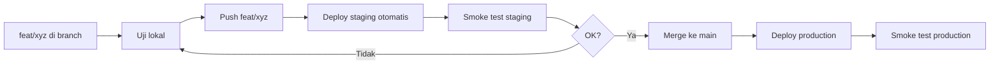

# SEPS — Proses Release (Production Aman)

Panduan ini menjawab: **bagaimana update fitur tanpa merusak toko yang sedang live**, dan **mengapa lokal OK tapi production gagal**.

---

## Mengapa lokal OK, production gagal?

| Perbedaan | Lokal (`npm run dev`) | Production (`seps.fazagroup.id`) |
|-----------|----------------------|----------------------------------|
| Database | Sering `.env` yang sama dengan Neon | Neon yang sama, tapi **data tenant live** berbeda |
| Build | Dev server, hot reload | Docker image — `VITE_*` di-bake saat build |
| Migrasi SQL | Bisa lupa jalankan | Harus sudah applied sebelum fitur dipakai |
| Sesi kasir | In-memory, reset tiap refresh | Banyak sesi `open` menumpuk di DB (bug lama) |
| Uji otomatis | Jarang dijalankan | Harus jadi gate sebelum merge ke `main` |

**Kesimpulan:** Lokal hanya membuktikan kode *bisa* jalan. Production membuktikan kode + database + build + data real *benar-benar* jalan.

---

## Arsitektur 3 lingkungan (disarankan)

```
┌─────────────────┐     ┌──────────────────┐     ┌─────────────────────┐
│  Lokal          │     │  Staging         │     │  Production         │
│  localhost:8081 │ ──► │  staging.seps…   │ ──► │  seps.fazagroup.id  │
│  dev + .env     │     │  Railway service │     │  Railway service    │
└─────────────────┘     └──────────────────┘     └─────────────────────┘
         │                         │                          │
         └─────────────────────────┴──────────────────────────┘
                                   │
                          Neon PostgreSQL
                    (branch staging / prod terpisah idealnya)
```

### Langkah setup staging (sekali)

1. **Neon Console** → buat **branch** `staging` dari production (copy schema + optional data)
2. **Railway** → service baru `seps-staging`, connect repo yang sama, branch Git `staging`
3. **DNS** → `staging.seps.fazagroup.id` CNAME ke Railway staging
4. Variables staging:
   - `DATABASE_URL` / `DATABASE_URL_DIRECT` → connection string branch staging
   - `AUTH_URL=https://staging.seps.fazagroup.id`
   - `VITE_PUBLIC_APP_URL=https://staging.seps.fazagroup.id`
   - `VITE_DATA_BACKEND=neon`
5. Uji login + POS + modul yang diubah **di staging** sebelum merge ke `main`

> Production dan staging **tidak boleh** share database yang sama jika ingin uji migrasi/destructive change dengan aman.

---

## Checklist WAJIB sebelum merge ke `main`

Jalankan di mesin dev (`.env` menunjuk ke Neon **staging** atau branch uji):

```bash
npm run build
npm run neon:health
npm run neon:migrate          # pastikan 0 pending
npm run neon:uat:sync         # E2E POS → stok → kasir (min. 19/20 pass)
```

Opsional sesuai fitur:

```bash
npm run neon:uat:returns      # jika sentuh retur
npm run neon:uat:pricing      # jika sentuh harga tier
npx tsx scripts/diagnose-pos-checkout.ts tb-arkananta   # tenant live tertentu
```

**Jangan push ke `main` jika:**

- `build` gagal
- `neon:uat:sync` gagal (>1 test fail)
- Ada migrasi SQL baru yang belum diapply ke Neon production

---

## Alur Git yang aman untuk banyak toko



### Smoke test production (5 menit)

Setelah deploy `main`:

1. https://seps.fazagroup.id/health → `ok: true`, `database.ok: true`
2. Login tenant uji (bukan demo mock)
3. **POS:** buka shift → 1 transaksi tunai kecil → cek stok turun
4. **Master Barang:** tambah produk + stok awal → stok tampil benar
5. Modul yang baru diubah (1 skenario happy path)

---

## Migrasi database

| Kapan | Perintah | Di mana |
|-------|----------|---------|
| Sebelum deploy fitur DB | `npm run neon:migrate` | Staging dulu, lalu production |
| Setelah deploy | Cek `/health` | Production |
| Runtime safety net | `ensurePosSchema()` dll. | Otomatis saat checkout (backup) |

File SQL ada di `neon/*.sql`. Tracking di tabel `schema_migrations`.

Jika migrasi gagal karena DB sudah ada tapi belum tercatat:

```bash
node scripts/repair-schema-migrations.mjs
npm run neon:migrate
```

---

## Rollback cepat (production bermasalah)

1. **Railway** → Deployments → pilih deployment **sebelumnya** yang hijau → **Redeploy**
2. Jangan rollback migrasi SQL kecuali Anda tahu dampaknya (biasanya **jangan**)
3. Umumkan ke toko: hard refresh browser (Ctrl+Shift+R)

---

## Prinsip untuk tim / solo dev

1. **`main` = etalase live** — hanya merge setelah staging OK
2. **Satu perubahan besar = satu release** — mudah rollback
3. **Uji against Neon**, bukan hanya mock/localStorage
4. **Jangan commit `.env`** — credentials beda per lingkungan
5. **Log server** (`Railway → Logs`) cek `[SEPS] db error` jika kasir lapor gagal

---

## Perbaikan operasional (2026-08)

- Shift kasir: **reuse sesi open** yang sama (tidak buat 50 sesi menumpuk)
- Refresh halaman POS: **restore shift** dari DB otomatis
- Error DB: log lengkap di server, pesan singkat di UI kasir
- Stok produk baru: **stok awal** ikut tersimpan ke `branch_products`

Lihat juga: [WORKFLOW_GIT.md](./WORKFLOW_GIT.md), [DEPLOY.md](../DEPLOY.md)
