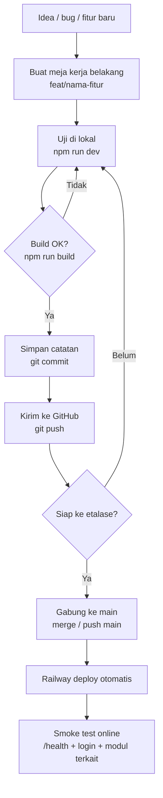

# SEPS — Workflow Git (dengan analogi sederhana)

Panduan ini untuk **Anda sendiri** (solo dev, 2 komputer: PC rumah + MacBook luar).  
Istilah Git dijelaskan pakai analogi dulu, baru perintahnya.

---

## 1. Bayangkan SEPS seperti toko bangunan

| Istilah teknis | Analogi sehari-hari | Artinya untuk SEPS |
|----------------|---------------------|-------------------|
| **Repository (repo)** | Buku resep + catatan bangunan toko | Semua kode SEPS di GitHub |
| **Branch `main`** | Etalase toko yang **sudah dibuka pelanggan** | Setiap push ke sini → Railway deploy ke `seps.fazagroup.id` |
| **Feature branch** (`feat/...`) | Meja kerja di **gudang belakang** | Anda eksperimen di sini; pelanggan belum lihat |
| **Commit** | Menyimpan satu lembar catatan perubahan | Snapshot kecil: "hari ini saya pasang rak baru" |
| **Push** | Kirim catatan ke **arsip pusat (GitHub)** | PC dan MacBook bisa ambil versi yang sama |
| **Pull** | Ambil catatan terbaru dari arsip pusat | Sebelum kerja, pastikan tidak ketinggalan |
| **Merge** | Pindahkan hasil kerja gudang → etalase | Gabung feature branch ke `main` → siap deploy |
| **`.env`** | Kunci brankas + PIN kasir | **Tidak** disimpan di GitHub — pindah manual antar komputer |
| **`npm run dev`** | Simulator di ruang latihan | Uji di `localhost:8081` — pelanggan tidak terpengaruh |
| **`npm run build`** | Cek apakah rak bisa dipasang beneran | Kalau gagal di sini, jangan buka etalase (jangan push) |
| **Deploy Railway** | Buka pintu toko pagi-pagi | Otomatis setiap `main` di-push |

**Inti satu kalimat:**  
> Jangan langsung ubah etalase (`main`) kalau belum uji di ruang latihan (lokal) dan meja kerja belakang (feature branch).

---

## 2. Alur kerja harian (yang disarankan)



### Langkah praktis (copy-paste)

**Mulai fitur baru** (di PC atau MacBook):

```bash
git pull origin main
git checkout -b feat/nama-fitur-jelas
npm run dev
```

**Setelah selesai sesi kerja** (penting saat pindah PC ↔ Mac):

```bash
git add .
git commit -m "feat: deskripsi singkat apa yang berubah"
git push -u origin feat/nama-fitur-jelas
```

**Sebelum gabung ke etalase (`main`):**

```bash
npm run build
npm run neon:health    # jika sentuh database/server
```

**Siap deploy:**

```bash
git checkout main
git pull origin main
git merge feat/nama-fitur-jelas
git push origin main
```

Railway akan deploy otomatis. Cek: https://seps.fazagroup.id/health

---

## 3. PC rumah ↔ MacBook — seperti 2 kasir, 1 buku besar

Anda punya **dua meja kerja**, tapi **satu arsip pusat** (GitHub).

| Situasi | Yang harus dilakukan |
|---------|---------------------|
| Selesai kerja di PC, mau lanjut di Mac | **Push** dulu — jangan tinggalkan perubahan hanya di PC |
| Buka MacBook pagi hari | **Pull** dulu — ambil kerja kemarin dari GitHub |
| Lupa push kemarin | MacBook tidak punya perubahan itu — harus kembali ke PC atau ulang kerja |
| File `.env` | Seperti kunci brankas — **copy manual** (password manager / USB), jangan WhatsApp |
| `package.json` berubah | Di MacBook jalankan `npm install` setelah pull |

**Ritual 30 detik setiap buka laptop:**

```bash
git pull
npm install          # hanya jika ada perubahan dependency
npm run dev
```

**Ritual 1 menit sebelum tutup laptop:**

```bash
git status           # ada file merah? commit dulu
git push
```

---

## 4. Penamaan branch (meja kerja belakang)

Pakai prefix + deskripsi pendek:

| Prefix | Kapan dipakai | Contoh |
|--------|---------------|--------|
| `feat/` | Fitur baru | `feat/delivery-neon` |
| `fix/` | Perbaikan bug | `fix/pos-void-cache` |
| `docs/` | Dokumentasi saja | `docs/workflow-git` |
| `chore/` | Tooling, deps, refactor kecil | `chore/eslint-rules` |

Hindari nama vague: `test`, `update`, `fix-bug`.

---

## 5. Pesan commit — catatan yang bisa dibaca nanti

Format singkat:

```
feat: tambah rollup penjualan harian di laporan
fix: POS tidak refresh stok setelah checkout
docs: panduan workflow git untuk 2 komputer
```

**Analogi:** seperti label di kotak gudang — 6 bulan lagi Anda tahu isinya apa.

---

## 6. Checklist sebelum push ke `main` (buka etalase)

Centang mental ini sebelum merge/push ke `main`:

- [ ] Sudah jalan di lokal (`npm run dev`) — flow yang Anda ubah OK
- [ ] `npm run build` **lulus** (wajib)
- [ ] Perubahan database: SQL sudah diuji / di-apply dengan hati-hati (Neon shared)
- [ ] Tidak ada file rahasia (`.env`, `.env.railway.local`) ikut commit
- [ ] Commit kecil & jelas — bukan 50 file random sekaligus kalau bisa dihindari
- [ ] Setelah push: cek `/health`, login, dan **1 modul** yang Anda sentuh

### Tingkat risiko — kapan extra hati-hati?

| Perubahan | Analogi | Wajib lokal + build? |
|-----------|---------|----------------------|
| Teks / warna UI | Ganti spanduk toko | Ya (build), uji cepat |
| POS / transaksi / void | Uang di kasir | **Ya + uji manual teliti** |
| Auth / login | Gembok pintu | **Ya + uji login Google & PIN** |
| Migration SQL | Ubah struktur gudang | **Ya + backup plan** |
| Cache / Redis | Sistem AC toko | Ya + cek `/health` setelah deploy |

---

## 7. Tiga skenario — pilih yang mana?

### A) Perbaikan kecil (typo, styling)

```
main ← langsung OK, tapi tetap: dev lokal → build → commit → push main
```

### B) Fitur baru (normal — **paling sering**)

```
feat/nama → lokal → build → push feat → merge main → deploy
```

### C) Eksperimen / belum yakin

```
feat/coba-xxx → push feat saja → jangan merge main dulu
```

**Analogi:** rak display percobaan di gudang — jangan pindah ke etalase sebelum yakin.

---

## 8. Perintah darurat (jangan panik)

| Masalah | Analogi | Perintah |
|---------|---------|----------|
| "File saya hilang setelah pull" | Belum commit = catatan di meja, belum ke arsip | Cek `git stash list`, `git reflog` |
| "Conflict saat merge" | Dua kasir edit baris yang sama | Buka file bertanda `<<<<`, pilih versi benar, commit |
| "Salah push tapi belum deploy selesai" | Spanduk salah terpasang | Revert commit baru di `main` (minta bantuan Agent jika ragu) |
| "Build gagal di Railway" | Pintu toko macet | Baca log Railway → perbaiki lokal → push lagi |

---

## 9. Database Neon — catatan penting

Sekarang lokal dan production bisa pakai **Neon yang sama**.  
**Analogi:** gudang pusat yang sama dipakai simulator dan toko live.

- Migration SQL di lokal = mempengaruhi data live  
- Ke depan: pertimbangkan **Neon branch** terpisah untuk dev (gudang latihan), production tetap branch utama

---

## 10. Ringkasan 1 halaman (tempel di meja)

```
┌─────────────────────────────────────────────────────────┐
│  SEBELUM KERJA     git pull                             │
│  SAAT KERJA        feat/xxx → npm run dev               │
│  SEBELUM TUTUP     git commit + git push                  │
│  SEBELUM ETALASE   npm run build → merge main → push    │
│  SETELAH DEPLOY    cek /health + modul yang diubah      │
│  KUNCI BRANKAS     .env manual, JANGAN commit           │
└─────────────────────────────────────────────────────────┘
```

---

## 11. Dokumen terkait

- [DEPLOY.md](../DEPLOY.md) — Railway, env production, domain
- [neon/README.md](../neon/README.md) — setup & migration database
- [SCALING_PRIORITIES.md](./SCALING_PRIORITIES.md) — prioritas teknis skala multi-tenant
